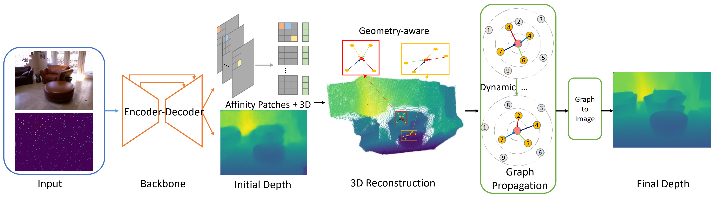

# GraphCSPN: Geometry-Aware Depth Completion via Dynamic GCNs
This is a PyTorch implementation of the ECCV 2022 paper. **[[ArXiv](https://arxiv.org/abs/2210.10758)]** **[[ECCV](https://link.springer.com/chapter/10.1007/978-3-031-19827-4_6)]**

## Introduction



Image guided depth completion aims to recover per-pixel dense depth maps from sparse depth measurements with the help of aligned color images, which has a wide range of applications from robotics to autonomous driving. However, the 3D nature of sparse-to-dense depth completion has not been fully explored by previous methods. In this work, we propose a Graph Convolution based Spatial Propagation Network (GraphCSPN) as a general approach for depth completion. First, unlike previous methods, we leverage convolution neural networks as well as graph neural networks in a complementary way for geometric representation learning. In addition, the proposed networks explicitly incorporate learnable geometric constraints to regularize the propagation process performed in three-dimensional space rather than in two-dimensional plane. Furthermore, we construct the graph utilizing sequences of feature patches, and update it dynamically with an edge attention module during propagation, so as to better capture both the local neighboring features and global relationships over long distance. Extensive experiments on both indoor NYU-Depth-v2 and outdoor KITTI datasets demonstrate that our method achieves the state-of-the-art performance, especially when compared in the case of using only a few propagation steps.

## Requirements
* Ubuntu 18.04 / Ubuntu 20.04
* Python 3.7
* [PyTorch](https://pytorch.org) >= 1.8.0 
* [Torchvision](https://pytorch.org) >= 0.9.0 
* [Pytorch geometric](https://github.com/pyg-team/pytorch_geometric)
* cudatoolkit 11.1
* h5py 3.7

## Usage
We use the [HDF5](https://github.com/fangchangma/sparse-to-dense) version of the [NYU-Depth-V2 dataset](https://cs.nyu.edu/~silberman/datasets/nyu_depth_v2.html). After downloading the dataset, training with the 
default hyperparameters can be started using the following commands:
```bash
$ cd GraphCSPN
$ bash train.sh
```
or you can change the hyperparameters with the following training script:
```bash
$ python main.py \
  --dir_data /path/to/your/dataset \
  --dist-url 'tcp://localhost:10001' --multiprocessing-distributed --world-size 1 --rank 0 \
  --split_json ./data/nyu.json --num_sample 500 \
```
More code and models will be uploaded soon!

## Citation

```
@inproceedings{liu2022graphcspn,
  title={GraphCSPN: Geometry-Aware Depth Completion via Dynamic GCNs},
  author={Liu, Xin and Shao, Xiaofei and Wang, Bo and Li, Yali and Wang, Shengjin},
  booktitle={European Conference on Computer Vision},
  pages={90--107},
  year={2022},
  organization={Springer}
}
```
If you have any questions about the code or the paper, feel free to contact me via xinliu20@mails.tsinghua.edu.cn
